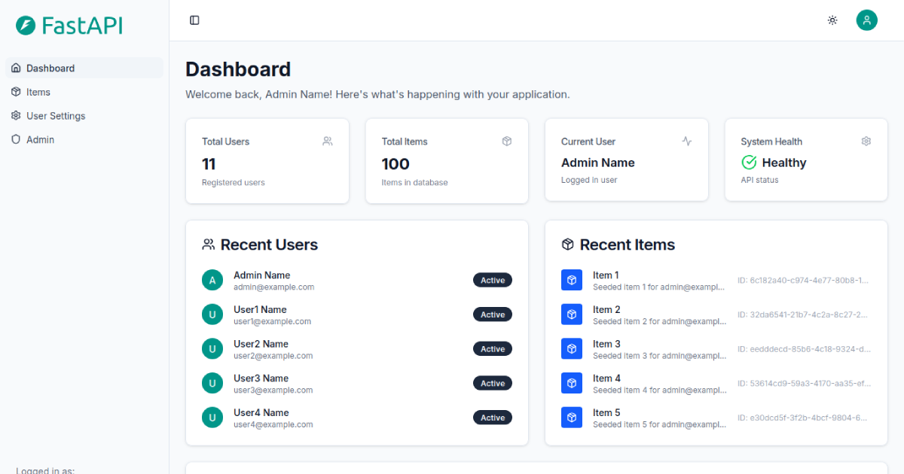

# Full stack FastAPI template Next.js

Next.js v16 fork of the official [fastapi/full-stack-fastapi-template](https://github.com/fastapi/full-stack-fastapi-template) template. Server components, server actions, HttpOnly cookie auth, ShadcnUI with TailwindCSS v4, simplified local development environment and Docker production.

## Demo

**Docker: [https://full-stack-fastapi-template-nextjs.arm1.nemanjamitic.com](https://full-stack-fastapi-template-nextjs.arm1.nemanjamitic.com)**

**Vercel: [https://full-stack-fastapi-template-nextjs.vercel.app](https://full-stack-fastapi-template-nextjs.vercel.app)**

## Screenshot



## Credits

- The original repository: [fastapi/full-stack-fastapi-template](https://github.com/fastapi/full-stack-fastapi-template)
- Next.js client side rendered PR: https://github.com/fastapi/full-stack-fastapi-template/pull/1733
- HttpOnly cookie PR: https://github.com/fastapi/full-stack-fastapi-template/pull/1606

## Features

- [x] Next.js v16, server components
- [x] React Hook Form and server actions for forms
- [x] HttpOnly cookie auth, enables SSR
- [x] Hey Api with client-next
- [x] Suspense, error boundaries
- [x] Turborepo monorepo, TailwindCSS v4, ShadcnUI
- [x] Validated env vars with Zod
- [x] Simple local dev environment, simplified Docker production

## Todo

- [x] Register page, Github login
- [ ] Migrate Playwright tests
- [ ] Unit tests with Vitest, Testing Library
- [ ] Tag Docker images
- [ ] API sort params
- [ ] Support emails, Sentry from the original repo
- [ ] no-monorepo branch
- [x] Runtime only env vars, reusable build
- [x] Env vars with [alizeait/next-public-env](https://github.com/alizeait/next-public-env)
- [ ] Versioning with [changesets/changesets](https://github.com/changesets/changesets) or [semantic-release/semantic-release](https://github.com/semantic-release/semantic-release)
- [ ] API internationalization
- [ ] Update Python
- [ ] Open graph, SEO, analytics
- [ ] Tailscale Github Actions
- [ ] Integration tests frontend and backend
- [x] Deploy with Vercel

## Installation and running

Docs: [docs/running.md](docs/running.md)

## Deploy to Vercel

If you want to deploy with Docker, use the `main` branch. If you want to deploy with Vercel, use the `vercel-deploy` branch.

```bash
# Docker
git checkout main

# Vercel
git checkout vercel-deploy
```
Similarly to how you need two separate containers to deploy the app with Docker, you also need two separate deployments in Vercel to deploy the frontend and backend. You will configure them to be aware of each other using `SITE_URL` and `API_URL`, which they use to communicate with each other.

You can deploy to Vercel either using "Vercel button" or Vercel CLI method. You can find more details about deploying using both methods in the documentation linked bellow.

Backend docs: [docs/vercel-deployment-backend.md](docs/vercel-deployment-backend.md)

Frontend docs: [docs/vercel-deployment-frontend.md](docs/vercel-deployment-frontend.md)

### Vercel button

[](https://vercel.com/new/clone?demo-description=Build%20full-stack%20apps%20with%20Next.js%20and%20FastAPI.&demo-image=https%3A%2F%2Fgithub.com%2Fnemanjam%2Ffull-stack-fastapi-template-nextjs%2Fraw%2Fmain%2Fdocs%2Fscreenshots%2Ffrontend-screenshot-1200x630.png&demo-title=Full%20stack%20FastAPI%20template%20with%20Next.js&demo-url=https%3A%2F%2Ffull-stack-fastapi-template-nextjs.vercel.app&project-name=Full%20stack%20FastAPI%20template%20with%20Next.js&repository-name=full-stack-fastapi-template-with-next-js&repository-url=https%3A%2F%2Fgithub.com%2Fnemanjam%2Ffull-stack-fastapi-template-nextjs%2Ftree%2Fvercel-deploy&project-names=full-stack-fastapi-frontend%2Cfull-stack-fastapi-backend&root-directories=frontend%2Fapps%2Fweb%2Cbackend&monorepo=1&totalProjects=2&skippable-integrations=1&products=%5B%7B%22type%22%3A%22integration%22%2C%22protocol%22%3A%22storage%22%2C%22productSlug%22%3A%22neon%22%2C%22integrationSlug%22%3A%22neon%22%7D%5D)

Clicking the "Deploy" button above will take you to the Vercel deployment wizard. It will create a **single GitHub repository** and **two separate Vercel projects**, pointing to the `/backend` and `/frontend/apps/web` directories for the backend and frontend, respectively. 

No environment variables will be set automatically, you will need to configure them manually after the wizard completes. During setup, you will be prompted to add the Neon integration for a Postgres database. Make sure to select the **backend** project as the integration target. Finally, you will need to run the database migrations and seed the newly provisioned database.

### Vercel CLI

You can also deploy to Vercel from you local development environment using Vercel CLI. 

## Routes

```bash
# Frontend
http://localhost:3000
https://full-stack-fastapi-template-nextjs.arm1.nemanjamitic.com

# Backend
http://localhost:8000/docs
https://api-full-stack-fastapi-template-nextjs.arm1.nemanjamitic.com/docs

# openapi.json
http://localhost:8000/api/v1/openapi.json
https://api-full-stack-fastapi-template-nextjs.arm1.nemanjamitic.com/api/v1/openapi.json
```

## License

MIT license: [License](LICENSE)
