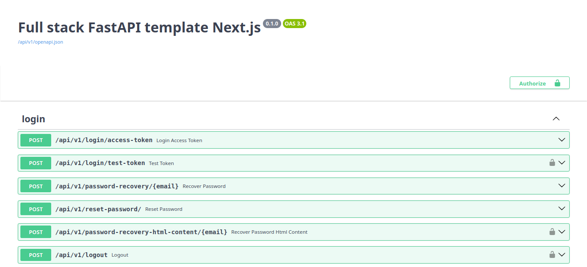

# Vercel deployment backend

## Demo

**[https://api-full-stack-fastapi-template-nextjs.vercel.app/docs](https://api-full-stack-fastapi-template-nextjs.vercel.app/docs)**

## Screenshot



## Environment variables

#### Minimal required environment variables

```bash
# Used in email templates and OpenAPI docs
PROJECT_NAME="Full stack FastAPI template Next.js"

# Frontend url
# Used by the backend to generate links in emails to the frontend
SITE_URL=my-frontend-url.vercel.app

# Superuser email and password
FIRST_SUPERUSER=admin@example.com
FIRST_SUPERUSER_PASSWORD=password

# Postgres database, e.g. Neon
# Format: postgresql://<username>:<password>@<host>/<database>?<query>
DATABASE_URL=
```

#### All available environment variables

```bash
# Used in email templates and OpenAPI docs
PROJECT_NAME="Full stack FastAPI template Next.js"

# Frontend url
# Used by the backend to generate links in emails to the frontend
SITE_URL=my-frontend-url.vercel.app

# Whitelisted frontend urls
# SITE_URL is included by default
BACKEND_CORS_ORIGINS="http://localhost,https://localhost,http://localhost:3000,https://localhost:3000,http://localhost:3001,https://localhost:3001,https://my-frontend-url.vercel.app"

# Environment: local, staging, production
# If omitted defaults to VERCEL_ENV
ENVIRONMENT=production

# Auth
# If omitted defaults to random base64 string
JWT_SECRET_KEY=secret
SESSION_SECRET_KEY=secret
# If omitted defaults to 7 days = 24 * 8 = 168 hours
ACCESS_TOKEN_EXPIRE_HOURS=168

# Superuser email and password
FIRST_SUPERUSER=admin@example.com
FIRST_SUPERUSER_PASSWORD=password

# Github OAuth id and secret
# Only a single deployment (callback url) per Github app is possible
GITHUB_CLIENT_ID=
GITHUB_CLIENT_SECRET=

# Postgres database, e.g. Neon
# Supply either all POSTGRES_* variables or a single DATABASE_URL
# If both are defined DATABASE_URL has precedence
POSTGRES_SERVER=localhost
POSTGRES_PORT=5432
POSTGRES_DB=app
POSTGRES_USER=postgres
POSTGRES_PASSWORD=password

# Format: postgresql://<username>:<password>@<host>/<database>?<query>
DATABASE_URL=
```

